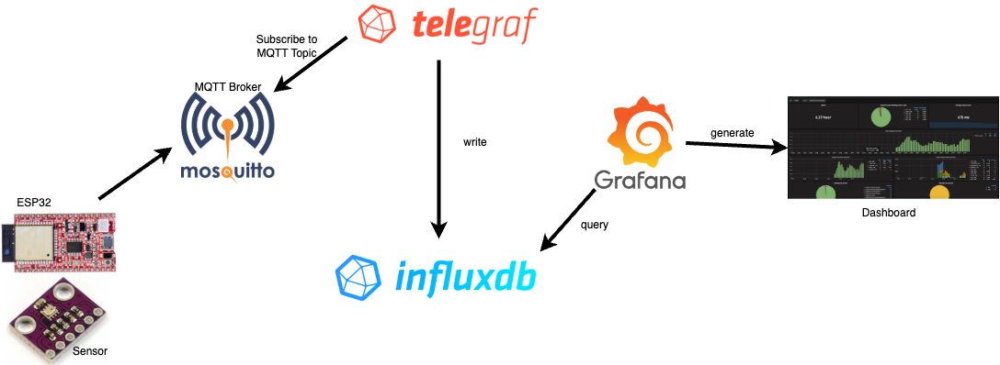
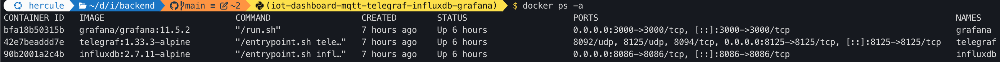

# Installing TIG-Stack


<figure markdown="span">
  { width="800" }
  <figcaption>Installation of TIG-Stack</figcaption>
</figure>

TIG:

**T** - Telegraf

**I** - InfluxDB

**G** - Grafana

## Overall working plan for the classroom project

1. Every student is installing the whole TIG-Stack locally on their Computer.
2. At the end, sensor data should be visible in Influx-DB. For this configuration-files have to be modified.
3. A Grafana - Dashboard should be created in order to see sensor-data. Experiment with the possibilities.
4. As a class, we'll design a common mqtt-topic structure. This structure has to be implemented by every student
5. A central TIG-Stack will be installed on a public VM
6. A central Grafana-Dashboard will show all Air-Pressure values from all students


## First Step: ESP32 ist publishing sensor-values to the MQTT-Broker
Be sure your ESP32 is publishing sensor-data to the MQTT-Broker. Check it with MQTT-Explorer.

## Second Step: Install TIG-Stack

### Installation Directory

!!! note

    Create a dedicated installation-Directory, with e.g. `mkdir docker-TIG`
    Put all following files into this directory files


### docker-compose.yml
We'll install the whole stack in one shot with docker. For this we need a `docker-compose.yml`

``` yaml title="docker-compose.yml" linenums="1"
services:
  #  mosquitto:
  #  image: eclipse-mosquitto:2.0.18
  #  container_name: mosquitto
  #  ports:
  #    - 1883:1883
  #  networks:
  #    - influxdb_network
  #  volumes:
  #    - ./mosquitto.conf:/mosquitto/config/mosquitto.conf:ro  # Read-only config file
  #    - mosquitto_data:/mosquitto/data  # Persistent data volume
  #    - mosquitto_log:/mosquitto/log  # Persistent log volume
  #  restart: unless-stopped

  influxdb:
    # image: influxdb:2.7.5-alpine
    image: influxdb:2.7.11-alpine
    container_name: influxdb
    ports:
      - 8086:8086
    volumes:
      - influxdb_data:/var/lib/influxdb2:rw
      # Optional: Mount a custom InfluxDB configuration file
      - influxdb_config:/etc/influxdb2:rw
    env_file:
      - influxdb.env
    networks:
      - influxdb_network
    restart: unless-stopped

  telegraf:
    # image: telegraf:1.29.5-alpine
    image: telegraf:1.33.3-alpine
    container_name: telegraf
    ports:
      - 8125:8125
    volumes:
      # Mount your Telegraf configuration file (replace with your path)
      - ./telegraf.conf:/etc/telegraf/telegraf.conf:ro
    networks:
      - influxdb_network
    restart: unless-stopped
    depends_on:
      - influxdb

  grafana:
    # image: grafana/grafana:10.2.4
    image: grafana/grafana:11.5.2
    container_name: grafana
    ports:
      - 3000:3000
    volumes:
      - grafana_storage:/var/lib/grafana
    env_file:
    - grafana.env
    networks:
      - influxdb_network
    restart: unless-stopped
    depends_on:
      - influxdb


networks:
  influxdb_network:

volumes:
  #mosquitto_data:
  #mosquitto_log:
  influxdb_data:
  influxdb_config:
  grafana_storage:
```


### grafana.env

``` yaml title="grafana.env" linenums="1"
GF_SECURITY_ADMIN_USER=admin
GF_SECURITY_ADMIN_PASSWORD=5up3rS3crEt
```

### influxdb.env

``` yaml title="influxdb.env" linenums="1"
DOCKER_INFLUXDB_INIT_MODE=setup

# Environment variables used during the setup and operation of the stack

# admin credentials
DOCKER_INFLUXDB_INIT_USERNAME=admin
DOCKER_INFLUXDB_INIT_PASSWORD=5up3rS3crEt
DOCKER_INFLUXDB_INIT_ADMIN_TOKEN=13dfffaaf8da2c2f83f90d9c462975ddab3978bf2e489f99ff983db39e726694 # openssl rand -base64 32

# Primary InfluxDB organization & bucket definitions
DOCKER_INFLUXDB_INIT_ORG=homeauto
DOCKER_INFLUXDB_INIT_BUCKET=default

# Primary InfluxDB bucket retention period

# NOTE: Valid units are nanoseconds (ns), microseconds(us), milliseconds (ms)
# seconds (s), minutes (m), hours (h), days (d), and weeks (w).
DOCKER_INFLUXDB_INIT_RETENTION=30d


# InfluxDB port & hostname definitions
DOCKER_INFLUXDB_INIT_PORT=8086
DOCKER_INFLUXDB_INIT_HOST=influxdb
```

### telegraf.conf
change it to your environment! See lines 143 ff !


``` yaml title="telegraf.conf " linenums="1"
# Telegraf Configuration
#
# Telegraf is entirely plugin driven. All metrics are gathered from the
# declared inputs, and sent to the declared outputs.
#
# Plugins must be declared in here to be active.
# To deactivate a plugin, comment out the name and any variables.
#
# Use 'telegraf -config telegraf.conf -test' to see what metrics a config
# file would generate.
#
# Environment variables can be used anywhere in this config file, simply surround
# them with ${}. For strings the variable must be within quotes (ie, "${STR_VAR}"),
# for numbers and booleans they should be plain (ie, ${INT_VAR}, ${BOOL_VAR})


# Global tags can be specified here in key="value" format.
[global_tags]
  # dc = "us-east-1" # will tag all metrics with dc=us-east-1
  # rack = "1a"
  ## Environment variables can be used as tags, and throughout the config file
  # user = "$USER"

# Configuration for telegraf agent
[agent]
  ## Default data collection interval for all inputs
  interval = "10s"
  ## Rounds collection interval to 'interval'
  ## ie, if interval="10s" then always collect on :00, :10, :20, etc.
  round_interval = true

  ## Telegraf will send metrics to outputs in batches of at most
  ## metric_batch_size metrics.
  ## This controls the size of writes that Telegraf sends to output plugins.
  metric_batch_size = 1000

  ## Maximum number of unwritten metrics per output.  Increasing this value
  ## allows for longer periods of output downtime without dropping metrics at the
  ## cost of higher maximum memory usage.
  metric_buffer_limit = 10000

  ## Collection jitter is used to jitter the collection by a random amount.
  ## Each plugin will sleep for a random time within jitter before collecting.
  ## This can be used to avoid many plugins querying things like sysfs at the
  ## same time, which can have a measurable effect on the system.
  collection_jitter = "0s"

  ## Collection offset is used to shift the collection by the given amount.
  ## This can be be used to avoid many plugins querying constraint devices
  ## at the same time by manually scheduling them in time.
  # collection_offset = "0s"

  ## Default flushing interval for all outputs. Maximum flush_interval will be
  ## flush_interval + flush_jitter
  flush_interval = "10s"
  ## Jitter the flush interval by a random amount. This is primarily to avoid
  ## large write spikes for users running a large number of telegraf instances.
  ## ie, a jitter of 5s and interval 10s means flushes will happen every 10-15s
  flush_jitter = "0s"

  ## Collected metrics are rounded to the precision specified. Precision is
  ## specified as an interval with an integer + unit (e.g. 0s, 10ms, 2us, 4s).
  ## Valid time units are "ns", "us" (or "µs"), "ms", "s".
  ##
  ## By default or when set to "0s", precision will be set to the same
  ## timestamp order as the collection interval, with the maximum being 1s:
  ##   ie, when interval = "10s", precision will be "1s"
  ##       when interval = "250ms", precision will be "1ms"
  ##
  ## Precision will NOT be used for service inputs. It is up to each individual
  ## service input to set the timestamp at the appropriate precision.
  precision = "0s"

  ## Log at debug level.
  # debug = false
  ## Log only error level messages.
  # quiet = false

  ## Log target controls the destination for logs and can be one of "file",
  ## "stderr" or, on Windows, "eventlog".  When set to "file", the output file
  ## is determined by the "logfile" setting.
  # logtarget = "file"

  ## Name of the file to be logged to when using the "file" logtarget.  If set to
  ## the empty string then logs are written to stderr.
  # logfile = ""

  ## The logfile will be rotated after the time interval specified.  When set
  ## to 0 no time based rotation is performed.  Logs are rotated only when
  ## written to, if there is no log activity rotation may be delayed.
  # logfile_rotation_interval = "0h"

  ## The logfile will be rotated when it becomes larger than the specified
  ## size.  When set to 0 no size based rotation is performed.
  # logfile_rotation_max_size = "0MB"

  ## Maximum number of rotated archives to keep, any older logs are deleted.
  ## If set to -1, no archives are removed.
  # logfile_rotation_max_archives = 5

  ## Pick a timezone to use when logging or type 'local' for local time.
  ## Example: America/Chicago
  log_with_timezone = "Europe/Zurich"

  ## Override default hostname, if empty use os.Hostname()
  hostname = "my_notebook"
  ## If set to true, do no set the "host" tag in the telegraf agent.
  omit_hostname = false
  # omit_hostname = true

  ## Method of translating SNMP objects. Can be "netsnmp" (deprecated) which
  ## translates by calling external programs snmptranslate and snmptable,
  ## or "gosmi" which translates using the built-in gosmi library.
  # snmp_translator = "netsnmp"

  ## Name of the file to load the state of plugins from and store the state to.
  ## If uncommented and not empty, this file will be used to save the state of
  ## stateful plugins on termination of Telegraf. If the file exists on start,
  ## the state in the file will be restored for the plugins.
  # statefile = ""

# Read metrics about cpu usage
[[inputs.cpu]]
  ## Whether to report per-cpu stats or not
  percpu = true
  ## Whether to report total system cpu stats or not
  totalcpu = true
  ## If true, collect raw CPU time metrics
  collect_cpu_time = false
  ## If true, compute and report the sum of all non-idle CPU states
  ## NOTE: The resulting 'time_active' field INCLUDES 'iowait'!
  report_active = false
  ## If true and the info is available then add core_id and physical_id tags
  core_tags = false

  # Configuration for sending metrics to InfluxDB 2.0
[[outputs.influxdb_v2]]
  ## The URLs of the InfluxDB cluster nodes.
  ##
  ## Multiple URLs can be specified for a single cluster, only ONE of the
  ## urls will be written to each interval.
  ##   ex: urls = ["https://us-west-2-1.aws.cloud2.influxdata.com"]
  urls = ["http://192.168.222.22:8086"]

  ## Token for authentication.
  token = "13dfffaaf8da2c2f83f90d9c462975ddab3978bf2e489f99ff983db39e726694"

  ## Organization is the name of the organization you wish to write to.
  organization = "homeauto"

  ## Destination bucket to write into.
  bucket = "default"
#
#
[[inputs.mqtt_consumer]]
  servers = ["tcp://mqttbroker:1883"]
  topics = ["btw2413/jaeggi/bme280/#"]
  username = "here_mqttuser"
  password = "mqttbroker_pw"
  data_format = "value"
  data_type = "float"

[[inputs.mqtt_consumer]]
  servers = ["tcp://mqttbroker:1883"]
  topics = ["btw2413/jaeggi/bme680/#"]
  username = "here_mqttuser"
  password = "mqttbroker_pw"
  data_format = "value"
  data_type = "float"

  ## Data format to consume.
  ## Each data format has its own unique set of configuration options, read
  ## more about them here:
  ## https://github.com/influxdata/telegraf/blob/master/docs/DATA_FORMATS_INPUT.md
```


### Start all docker container

`docker compose up -d`

Check, if container are running with

`docker ps -a`


<figure markdown="span">
  { width="1800" }
  <figcaption>`docker ps -a` container running?</figcaption>
</figure>


## Exploring Data in InfluxDB Data Explorer

Open a web browser and navigate to http://localhost:8086. Login in to InfluxDB with the credentials defined in the *influxdb.env* configuration file.

Then go to the "Data Explorer" tab:
Here, you can explore the data that arrive from Telegraf and stored in InfluxDB, execute queries, and visualize metrics.

## Configuring InfluxDB Data Source in Grafana
Open a web browser and navigate to http://localhost:3000. Login in to Grafana with the credentials defined in the *grafana.env* configuration file.

Open the menu from the top left-hand side and go to "Connections" > "Data Sources" > "Add data source". Choose "InfluxDB" as the type. Configure the following settings:

* Name: Provide a name for the data source.
* Query Language: Flux
* HTTP URL: http://influxdb:8086. or http://localhost:8086
* Auth: Basic auth
* Basic Auth Details: username and password defined in *influxdb.env*
* InfluxDB Details:
    * Organization: defined in *influxdb.env*
    * Token: defined in *influxdb.env*
    * Default Bucket: defined in *influxdb.env*

Click "Save & Test" to verify the connection


## Visualise time-series data using Grafana

In the InfluxDB Data Explorer, choose the data point you would like to plot, e.g. humidity, click first on "Submit" to explore and then to the "SCRIPT EDITOR" to view the Flux code.

Copy this Flux code. In Grafana, create a new dashboard or open an existing one. 

Add a new panel to the dashboard and edit the panel. 

Under the "Query" tab, choose "InfluxDB" as the data source. 

Paste the copied Flux code into the query editor. 

Configure visualization options as needed and click "Apply" to save the panel configuration.


[see here](https://github.com/vasilogi/iot-dashboard-mqtt-telegraf-influxdb-grafana?tab=readme-ov-file#set-up-the-monitoring-stack-mosquitto-telegraf-influxdb-grafana-).